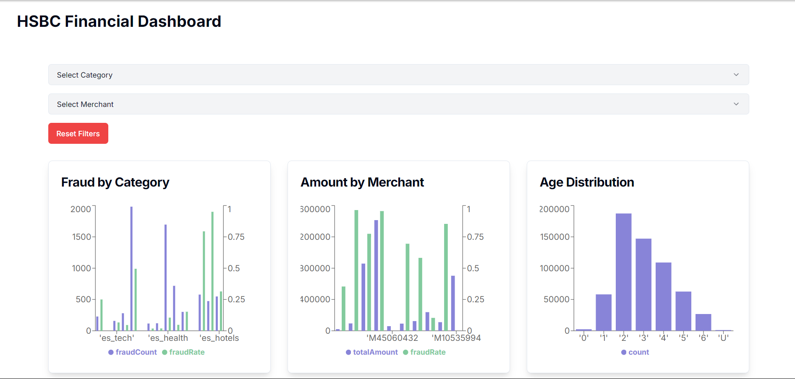
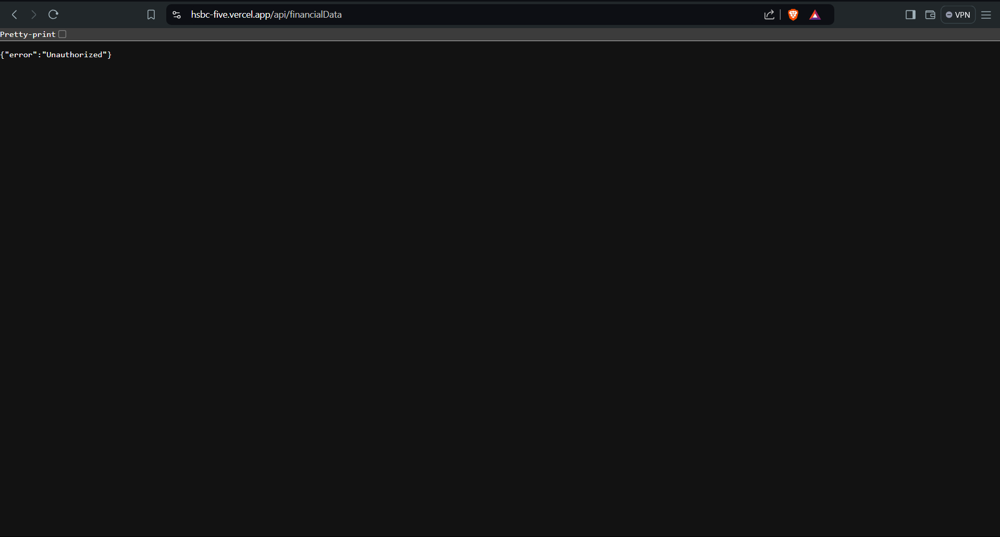
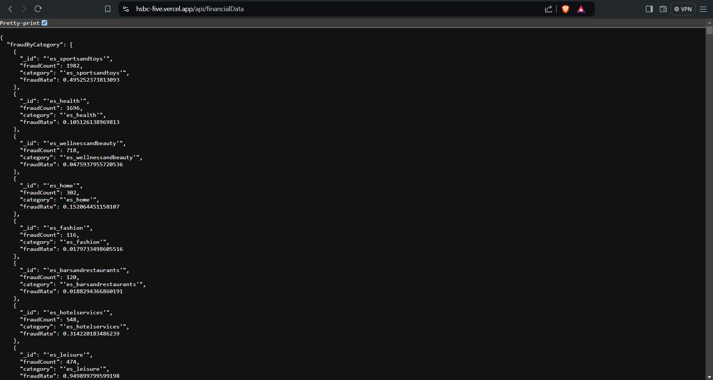
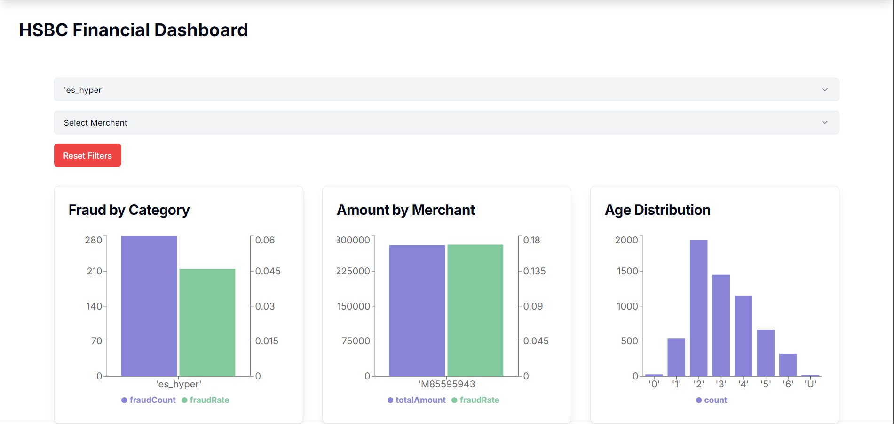

# Fraud Detection Dashboard

This is a comprehensive dashboard that provides insights into financial fraud detection using various data visualization techniques. The dashboard is built using React, TypeScript, Tailwind CSS, and Recharts.

## Key Features

1. **Fraud by Category**: This graph displays the number of fraud cases and the fraud rate for different transaction categories. This allows you to identify the categories that are more prone to fraud and take appropriate measures to mitigate the risk.

2. **Amount by Merchant**: This graph shows the total transaction amount and the fraud rate for the top merchants. This helps you identify merchants with high fraud rates and take necessary actions to address the issue.

3. **Age Distribution**: This graph visualizes the distribution of customers by age. This information can be used to understand the age demographic that is more susceptible to fraud and develop targeted fraud prevention strategies.

4. **Gender Distribution**: This pie chart displays the distribution of customers by gender. This data can be combined with other insights to analyze the relationship between gender and fraud patterns.

5. **Fraud Indicators**: This line chart shows the relationship between transaction amount and the number of fraud cases. This can help you identify the transaction amount thresholds that are more likely to be associated with fraudulent activities.

6. **Step Analysis**: This line chart tracks the total transaction count and the fraud count across different steps or stages of the payment process. This can help you pinpoint the specific steps where fraud is more prevalent and focus your efforts on improving the security measures at those critical points.

## Deployed on
```
https://hsbc-five.vercel.app/

```

## Customization

The dashboard is designed to be highly customizable and extendable. You can modify the following aspects to suit your specific needs:

1. **Data Fetching**: The `useEffect` hook in the `Dashboard` component fetches the data from the `/api/financialData` endpoint. You can customize this to fetch data from your own data sources.

2. **Data Visualization**: The Recharts components used in the dashboard can be further customized to change the chart types, colors, labels, and other visual elements.

3. **Filtering**: The dashboard currently allows users to filter the data by category, merchant, and age range. You can add more filtering options or modify the existing ones as per your requirements.

4. **Styling**: The Tailwind CSS classes used in the dashboard can be modified to match your design system and branding guidelines.

5. **Accessibility**: The dashboard includes some accessibility features, such as proper labeling and alternative text for charts. You can further enhance the accessibility by adding more ARIA attributes and following the WCAG guidelines.

6. **Performance**: The dashboard implements techniques like code splitting and lazy loading to optimize performance. You can explore additional optimization strategies based on your specific use case and data volume.

## Images
1. Charts

2. Api Authentication (unautheticated)

3. Api Athentication (authenticated)

4. Data fetch by category
